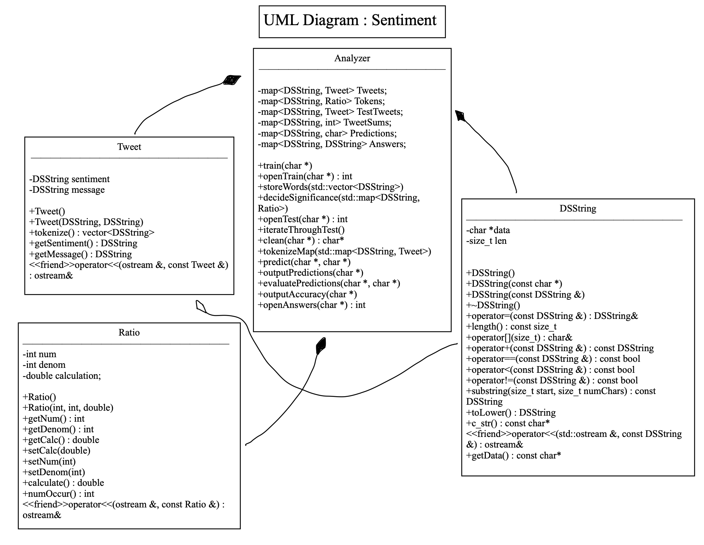

# Assignment 2: Answers

**Complete this document, commit your changes to Github and submit the repository URL to Canvas.** Keep your answers short and precise.

Your Name: Alex Geer

Used free extension: [X] 24 hrs or [ ] 48 hrs

[ ] Early submission (48 hrs)

[ ] Bonus work. Describe: ...

Place [x] for what applies.

## UML Diagram

Add your UML class diagram here.

Replace the following image with your diagram. You can draw it by hand and take a photo.

## Answers

1. How do you train the model and how do you classify a new tweet? Give a short description of the main steps.

    > To train the model, I first opened and parsed the training file, storing id numbers and tweets into Tweet objects. I cleaned and then stored these Tweet objects into a map of id numbers Tweets. I iterated the map through tokenize and stored each line of words into vector (tweet's sentiment at index 0). I then iterated through the vector and stored the words into a map of words and their respective ratios good-bad (using Ratio objs). This map is what is used to classify.
    > To classify, I opened and parsed the 

2. How long did your code take for training and what is the time complexity of your training implementation (Big-Oh notation)? Remember that training includes reading the tweets, breaking it into words, counting, ... Explain why you get this complexity (e.g., what does `N` stand for and how do your data structures/algorithms affect the complexity).

   > My code takes 953 ms to train. The time complexity is 

3. How long did your code take for classification and what is the time complexity of your classification implementation (Big-Oh notation)? Explain why.

   > My code takes 1407 ms in total, the classification process (just predicting) took 

4. How do you know that you use proper memory management? I.e., how do you know that you do not have a memory leak?

   > I made sure to continuously check my code for memory leaks using Valgrind. Valgrind tells me whether I have memory leaks. When sumbitting this program I, once again, checked to assure I had no memory leaks.

5. What was the most challenging part of the assignment?

   > The most challanging part of this assignment was dealing with pointers. I had a tough time working with the DSStrings. I'm not sure I had a good grasp on how pointers worked inside a program until this assignment. This project forced me to overcome that weakness.